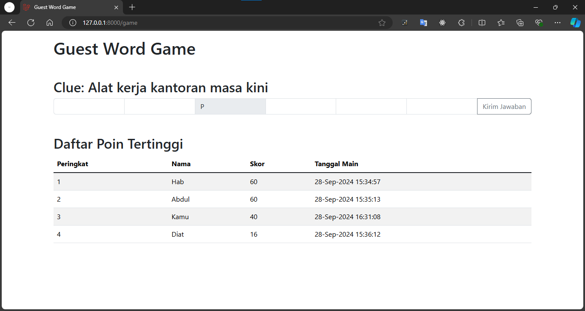
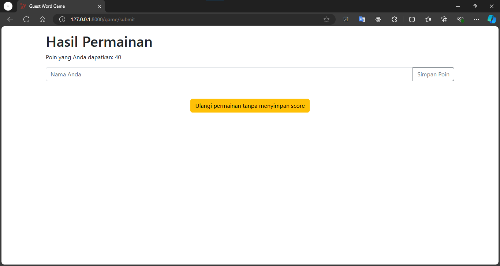

# GuestWord Game

**GuestWord** adalah sebuah aplikasi permainan asah otak di mana pemain harus menebak kata yang sesuai dengan clue yang diberikan. Setiap huruf yang benar dan salah akan memberikan poin yang berbeda. Permainan ini mencakup fitur untuk menyimpan skor pemain dan melihat daftar skor tertinggi.

## Fitur

-   Permainan tebak kata dengan clue yang diberikan.
-   Penilaian dinamis untuk setiap huruf yang benar atau salah.
-   Opsi untuk menyimpan skor dengan nama pemain.
-   Daftar skor tertinggi yang diurutkan berdasarkan nilai tertinggi.
-   Permainan dapat diulang tanpa menyimpan skor.

## Cara Bermain

1. **Mulai permainan**: Saat pertama kali permainan dimulai, sebuah kata akan dipilih secara acak dari database `master_kata`. Clue akan diberikan untuk membantu menebak kata.
2. **Input kata**: Pemain akan memasukkan jawaban ke dalam textbox sesuai dengan jumlah huruf kata yang harus ditebak. Setiap huruf ke-3 dan ke-7 dari kata tersebut akan diberikan sebagai petunjuk dan tidak dapat diubah.
3. **Penilaian**:
    - Setiap huruf yang benar akan mendapatkan **+10 poin**.
    - Setiap huruf yang salah akan dikenakan **-2 poin**.
4. **Menyelesaikan permainan**: Setelah pemain mengisi semua textbox, pemain dapat mengklik tombol **Submit** untuk menyelesaikan permainan.
5. **Simpan poin**: Pemain dapat memilih untuk menyimpan skor mereka setelah permainan berakhir. Jika memilih **Simpan Poin**, pemain akan diminta untuk memasukkan nama mereka, dan poin akan tersimpan di database.
6. **Lihat skor tertinggi**: Pemain dapat melihat daftar nama dan skor tertinggi
7. **Mulai ulang permainan**: Jika pemain memilih **Ulangi**, permainan akan dimulai kembali tanpa menyimpan data skor.

## Cara Install

### Prasyarat

Pastikan Anda sudah menginstall prasyarat berikut sebelum memulai:

-   PHP >= 7.4
-   Composer
-   MySQL atau MariaDB
-   Web server (misalnya Apache atau Nginx)

### Langkah-langkah Install

1. Clone repository ini ke lokal:

    ```bash
    git clone https://github.com/HadiatAbdulBashit/guest-word-angkasa-pura
    ```

2. Masuk ke folder project:

    ```bash
    cd guest-word-angkasa-pura
    ```

3. Install dependencies menggunakan Composer:

    ```bash
    composer install
    ```

4. Copy file `.env.example` ke `.env` dan sesuaikan pengaturan database:

    ```bash
    cp .env.example .env
    ```

5. Generate application key:

    ```bash
    php artisan key:generate
    ```

6. Buat database di MySQL dan sesuaikan file `.env` dengan konfigurasi database Anda:

    ```text
    DB_DATABASE=nama_database
    DB_USERNAME=root
    DB_PASSWORD=secret
    ```

7. Jalankan migration untuk membuat tabel yang dibutuhkan:

    ```bash
    php artisan migrate
    ```

8. Jalankan seeder untuk mengisi data awal ke tabel `master_kata`:

    ```bash
    php artisan db:seed
    ```

9. Jalankan server lokal:

    ```bash
    php artisan serve
    ```

    Aplikasi akan berjalan di `http://localhost:8000`.

## Struktur Database

**master_kata**: Tabel ini menyimpan kata dan clue untuk permainan.

| Column | Type         | Description             |
| ------ | ------------ | ----------------------- |
| `id`   | int(11)      | Primary key             |
| `kata` | varchar(255) | Kata yang harus ditebak |
| `clue` | varchar(255) | Petunjuk/clue dari kata |

**point_game**: Tabel ini menyimpan skor pemain yang telah selesai bermain.

| Column        | Type         | Description                       |
| ------------- | ------------ | --------------------------------- |
| `id_point`    | int(11)      | Primary key                       |
| `nama_user`   | varchar(255) | Nama pengguna yang menyimpan skor |
| `total_point` | int(20)      | Total poin yang diperoleh         |

## Teknologi yang Digunakan

-   **Framework**: Laravel
-   **Database**: MySQL
-   **Frontend**: Blade Templating Engine
-   **Backend**: PHP

## Screenshoot




